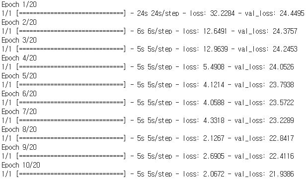
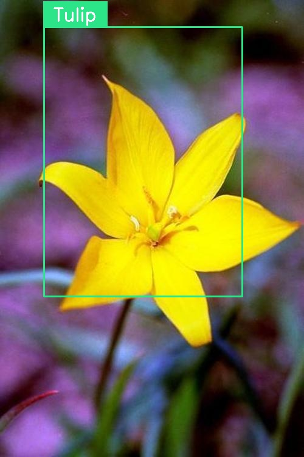

Object Detection using Keras YOLOv1
===========================================

Keras implementation of You Only Look Once.
https://pjreddie.com/darknet/yolo/  
Using 17 Category Flower Dataset.
http://www.robots.ox.ac.uk/~vgg/data/flowers/17/
	
    You Only Look Once: Unified, Real-Time Object Detection
    Joseph Redmon, Santosh Divvala, Ross Girshick, Ali Farhadi

Training Usage
-----

    python TrainingModel.py train_data_file validation_data_file output_model_file

    ex)
    python TrainingModel.py ./data/train_data.txt ./data/validation_data.txt ./model/yolo_model.h5

Training Result
-----

Detection Usage
-----

    python DetectionImage.py input_model_file label_file input_image_file output_image_file

    ex)
    python DetectionImage.py ./model/yolo_model.h5 ./model/flower_classes.txt
      ./example/tulip.jpg ./example/tulip_result.jpg

Detection Result
-----

 
